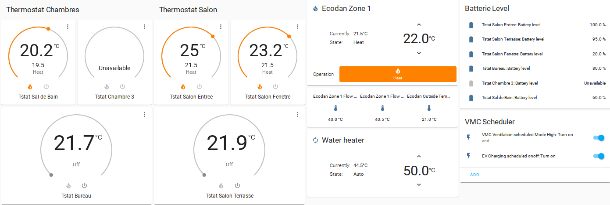
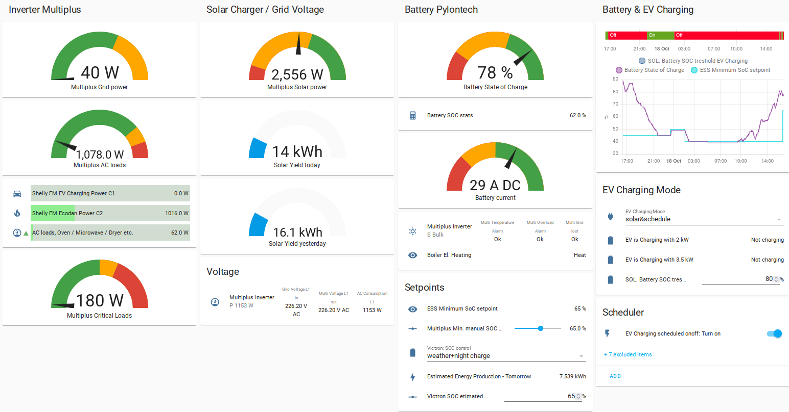
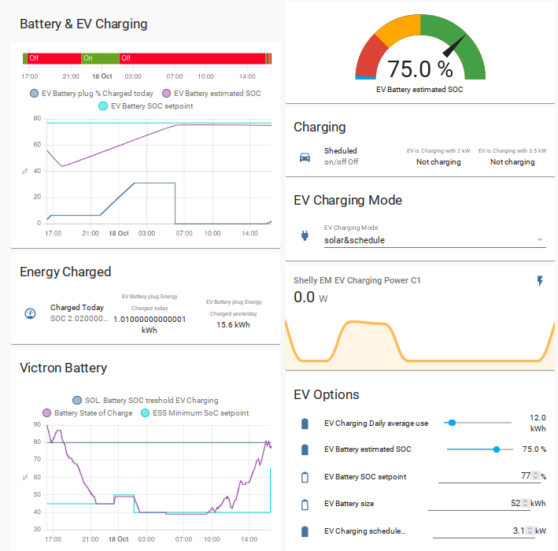

My Home-Assistant Setup 🚀️
============================

This Home Assistant configuration files are used mostly to control my energy management system.
If you are interested in these topics, it would make most sense if you have a PV system that you can control via HA and/or an electric vehicle, with a controllable plug.

In my case I use or have connected the following hardware connected to HA.

Heating: Mitsubishi Ecodan Heat pump with Z-Wave thermostats
------------------------------------------------------------

plus Shelly EM (Energy Meter) for power consumption tracking

Solar / PV: Victron Energy Multiplus connected via modbus
---------------------------------------------------------

ESS means Energy Storage System and does allow the control of the battery usage.

More Infos: [See more](docs/victron-pv-soc-control.md)

Smart EV Charging: Plug with contactor controlled over Z-Wave
-------------------------------------------------------------

plus Shelly EM (Energy Meter) for power consumption tracking. The system allows to track a virtual State of Charge of the car battery and so an optimal charge management.

More Infos: [See more](docs/smart-ev-charging.md)

Ventilation: Controlled over Z-Wave relais
------------------------------------------

tbd

## Used Software Components

- Node-red (for almost all the automations)
- Mitsubishi Melsec integration (to control the Heat Pump)
- HA Energy Dashboard

## Used HACS apps

- bar-card
- fan-control-entity-row
- lovelace-multiple-entity-row
- lovelace-paper-buttons-row
- mini-graph-card
- scheduler-card
- simple-thermostat

---

DISCLAIMER
----------

***This setup  can be used in your projects by you own risk. Or you can just take some inspiration from it.
The Node-Red automations (flows) are relative complex and all this is still a work in progress and may have still some edges and bugs.***
