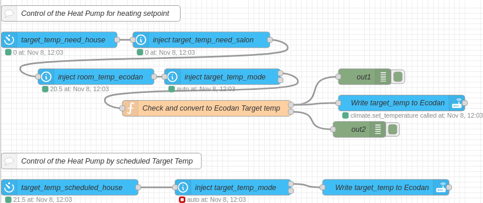
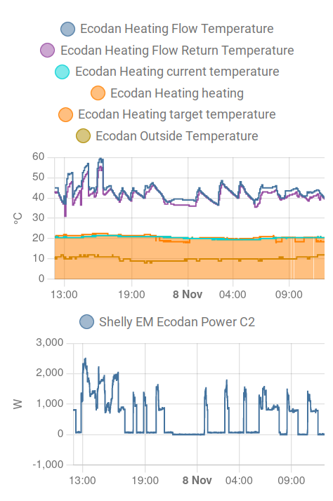

Heating (Heat Pump) control 🎉️
================================

This automation requires that your Heat Pump can be controlled by HA. In my case I have only one Room Thermostats of the
Heat Pump, which is not an ideal setup because if I need more heating power (eg. in the bathroom), if the room where the
Ecodan unit is located is warm enough, I can't heat the bathroom. the Schdeuler of the Thermostats aren't deman

So this flow sets the Mitsubishi Ecodan Target temperature according to the demand temp from all the Thermostats in relation
to the room temp. Or it can be set by a scheduler.

The automation has 3 modes:

- Manual (Manual setting of desired Room Temp)
- Scheduled (Over scheduler component)
- Auto (Controlled by the Z-Wave thermostats)

The target temp house and salon are sensor templates that add all the Delta T (Diff Air Temp / Target temp) in two values.
In the flow function I add those values together and calculate a decent target temp for the Ecodan Heat Pump.

As you can see that works quite well, so for instance during the night my Heat Pump goes to idle because the Thermostats aren't demand any heat.

(Please ignore the curves from 13:00 to 16:00 this is a mechanical problem.)

A solution without individual thermostats can be found here:

https://seanblanchfield.com/2022/02/automating-heating-with-home-assistant
