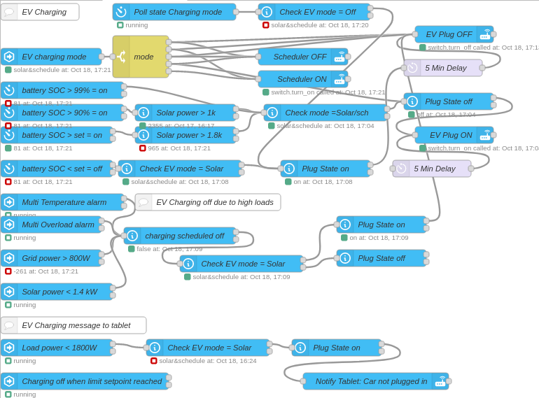
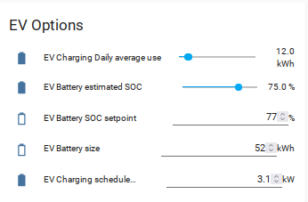
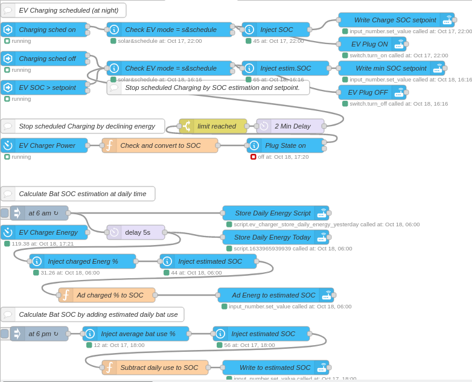

Smart-ev-charging 🎉️
======================

The EV Charging allow you to charge the EV Battery at home according your needs and with minimum power from the grid.

The Charging has 4 modes:

- Manual
- Solar (Charges if the Solar Battery SOC reaches a certain level)
- Schedule (Allows eg. charging at night with a lower grid tariff)
- Solar&Schedule (Combination of Solar&Scheduled charging)

Smart Scheduled Charging
------------------------

Smart Scheduled Charging allows to charge your car battery to a certain desired SOC over night in using a power meter like a Shelly EM.
As it does not make sense to charge the battery in most cases to 100% it is desirable to charge up to 80%, which allows still to charge the next day with solar. And anyway car batteries stay healthier if you don't charge it to 100%.

So Smart Scheduled Charging is a combination of Sheduled Charging plus Charging up to a certain setpoint in %. In my case I want to charge my battery to 80% overnight. But you need to adjust some paramters to do this.

vi
