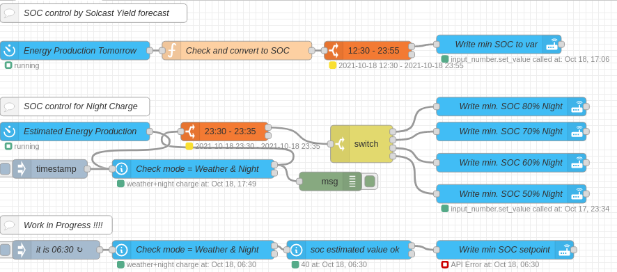

Victron multiplus ESS SOC control 🎉️
======================================

The Victron Inverter with ESS allows to control the minimal State Of Charge (SOC). This means if the minimal SOC is higher than
the actual SOC the battery gets charged ofer the grid. I use this to charge my battery over-night with the cheaper night tariff.

By using the Forecast.Solar integration I adjust the desired minimum SOC by the expected tomorrow solar yield.

The Charging has 2 modes:

- Weather forecast (set)
- Weather forecast & Night charge (Combination of forecast & Night charging)

